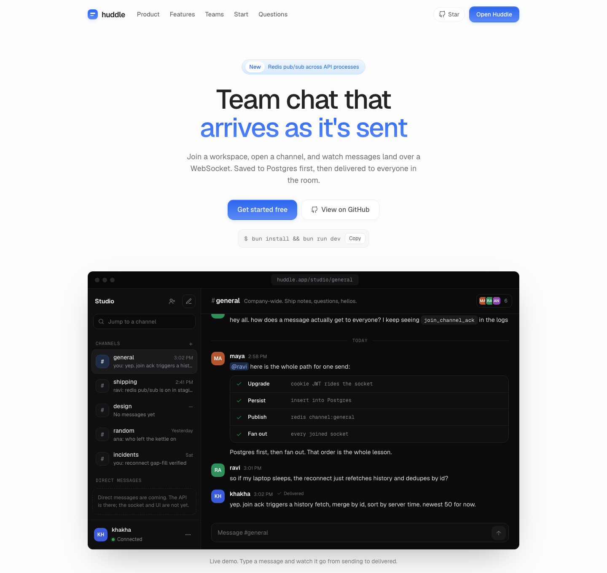

# Huddle

Live team chat. You join a workspace, open a channel, and messages show up as they are sent.

I built this to learn WebSockets. The rest of the app exists so that socket has somewhere real to live.



## Features

- Email and password accounts, optional GitHub OAuth
- Workspaces, channels, and invite links that expire in 7 days
- Message history over REST, live chat over WebSocket
- Acks, reconnect with backoff, and a session that can actually be revoked
- Redis pub/sub when you run more than one API process. Without it, each process talks only to its own sockets

Not built: presence, typing, and DMs in the UI. The REST DM endpoints exist. The socket answers `not_supported`.

## Stack

| Layer | Choice |
| --- | --- |
| Runtime | Bun + TypeScript |
| API | Express 5 |
| Realtime | `ws` on the same HTTP server |
| Database | PostgreSQL via Prisma |
| Frontend | React 19 + Tailwind v4 |
| Local infra | Docker Compose (Postgres, Redis, optional API image) |

## Quick start

You need [Bun](https://bun.sh) and Docker (for Postgres).

```bash
git clone https://github.com/shubhook/huddle.git
cd huddle
bun install
cp apps/server/.env.example apps/server/.env
# set JWT_SECRET to 32+ random characters: openssl rand -base64 48
docker compose up postgres -d
bun run db:generate
bun run db:migrate
bun run dev
```

Open [http://localhost:3008](http://localhost:3008). The API is [http://localhost:3000](http://localhost:3000).

Full env, Compose, GitHub OAuth, and the smoke check live in the [setup guide](./docs/setup.md).

## Repo layout

```text
apps/server   HTTP API + WebSocket
apps/web      React client (hash routes, port 3008)
docs/         setup and how each piece works
```

## Documentation

- [Setup](./docs/setup.md)
- [Architecture](./docs/architecture.md)
- [Auth and sessions](./docs/auth.md)
- [Workspaces and channels](./docs/workspaces.md)
- [Realtime](./docs/realtime.md)
- [Web client](./docs/web.md)
- [HTTP and WebSocket API](./docs/api.md)
- [Security](./docs/security.md)

Package notes: [`apps/server`](./apps/server/README.md), [`apps/web`](./apps/web/README.md).

## Status

Work in progress. The socket has validation, acks, reconnect, heartbeats, and Redis fan-out. Next is presence and DMs over the socket.
